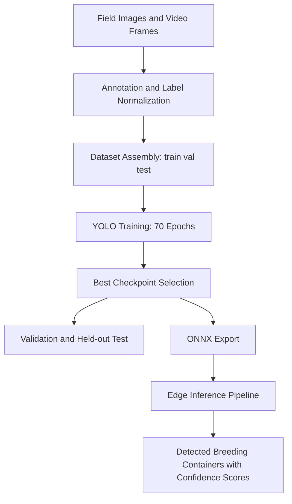

4. Design

### 4.1 System Architecture
MosKita follows a modular object-detection architecture:
1. Data acquisition and annotation
2. Dataset remapping and assembly
3. Model training and validation
4. Held-out testing and per-class analysis
5. Model export to ONNX for deployment pipelines

### 4.2 Block Diagram (Conceptual)

### 4.3 Detection Class Schema (Final Run)
| Class ID | Class Name |
|---:|---|
| 0 | discarded_tire |
| 1 | flower_pot |
| 2 | coconut_shell |
| 3 | basin |
| 4 | drain_inlet |
| 5 | drum |
| 6 | bucket |
| 7 | styrofoam_container |

### 4.4 Final Model Design and Configuration
The final model was trained from a pretrained Ultralytics checkpoint (yolo26n.pt) and saved under run name moskita_v1210. The design prioritizes compactness and practical speed for surveillance use cases while preserving acceptable localization quality.

### Table 5. Final Model Training Configuration (70-Epoch Run)
| Parameter | Value |
|---|---|
| Task | detect |
| Base model | yolo26n.pt |
| Epochs | 70 |
| Image size | 640 |
| Batch size | 24 |
| Optimizer | AdamW |
| Initial learning rate (lr0) | 0.001 |
| Final LR factor (lrf) | 0.01 |
| Weight decay | 0.0005 |
| Patience | 15 |
| Cosine LR | True |
| Mosaic | 1.0 (close_mosaic=10) |
| Horizontal flip | 0.5 |
| Rotation | 10.0 |
| Seed | 42 |
| Deterministic | True |
| Device | GPU 0 (RTX 2060) |

### 4.5 Source-Code Design Components
1. scripts/remap_yolo_dataset.py: merges/remaps annotation sources into project taxonomy.
2. notebooks/training.ipynb: orchestrates dataset checks, training, evaluation, and export.
3. utils/moskita_dataset_report.py and utils/moskita_run_report.py: reusable reporting and metric summaries.
4. models/runs/moskita_v1210: immutable evidence directory containing args.yaml, results.csv, and weights.

### 4.6 Deployment Design
The best checkpoint is exported to ONNX and copied to project export paths used by downstream inference applications. This design separates training-time artifacts from deployment-time artifacts while preserving reproducibility and traceability.

Design references: Ultralytics model/train documentation (Ultralytics, 2026a, 2026b), ONNX Runtime deployment model (Microsoft, 2026).
