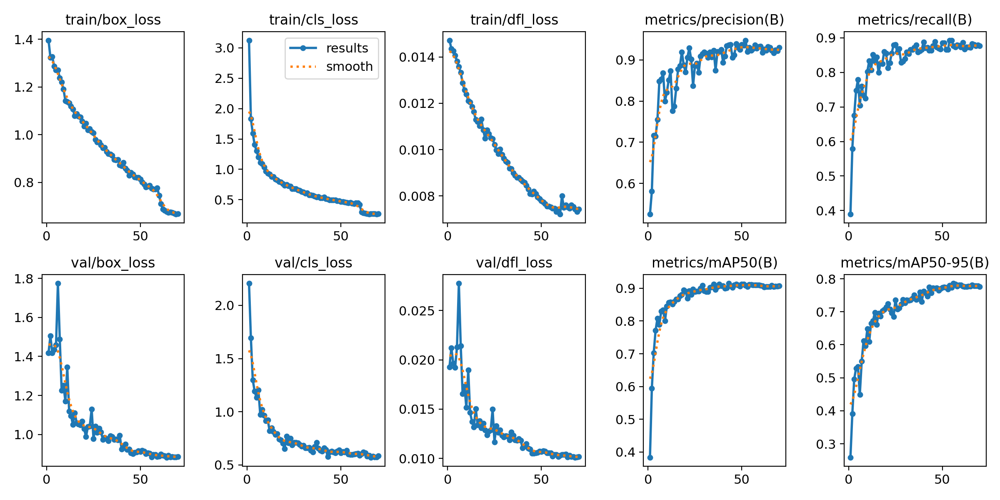
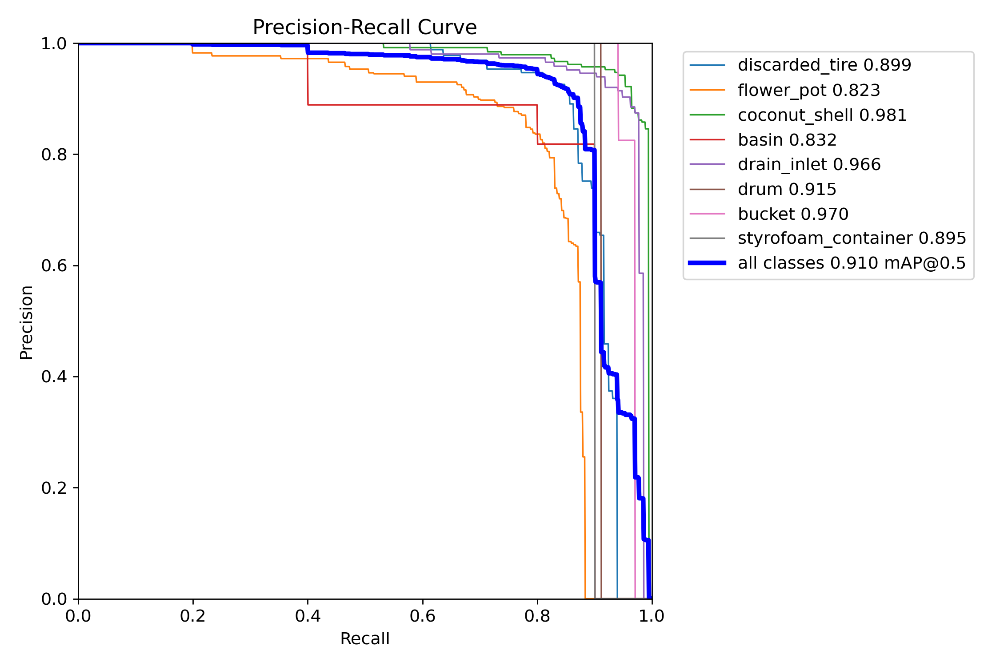
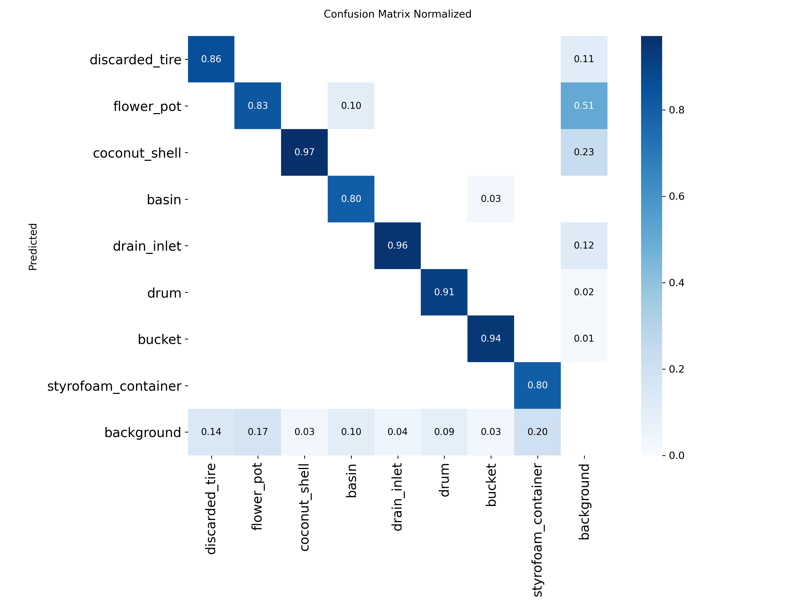
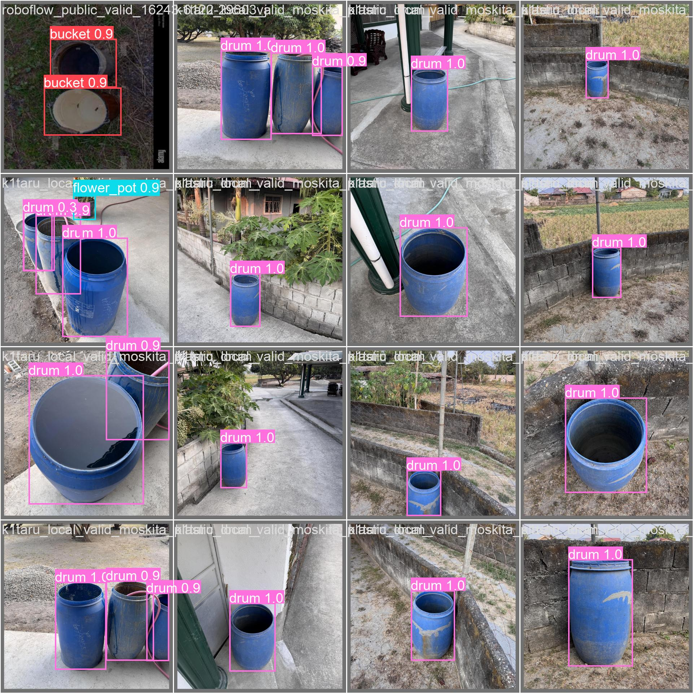
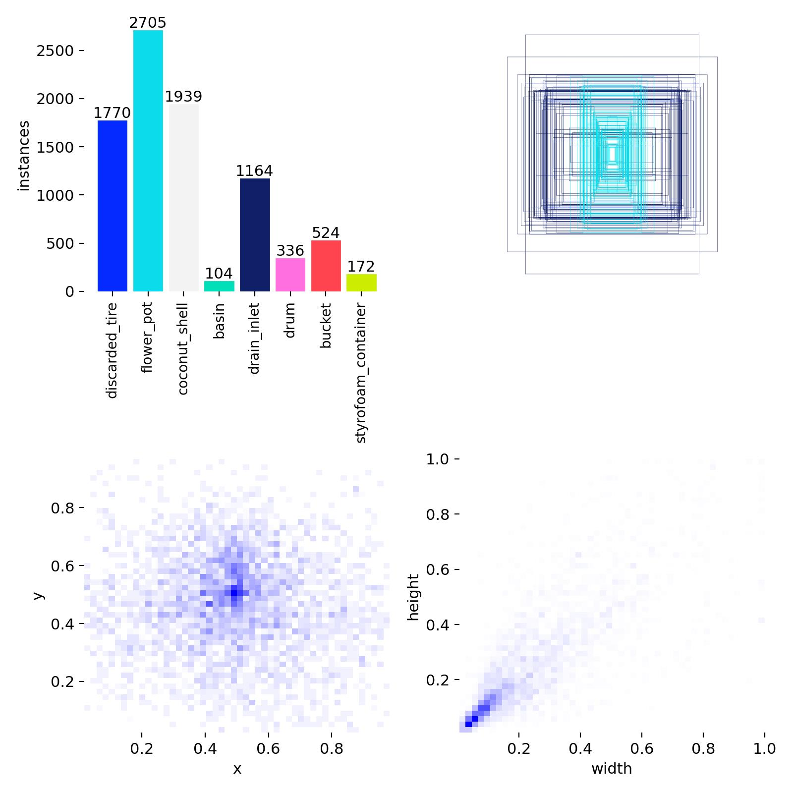

7. Presentation of Result, Analysis, and Interpretation

### 7.1 Final Run Identity
This section reports the final selected model from the 70-epoch training run:
1. Run name: moskita_v1210
2. Weights: models/runs/moskita_v1210/weights/best.pt
3. Training log: models/runs/moskita_v1210/results.csv

### 7.2 Training Progression Summary
The run completed 70 epochs with total recorded training time of 5077.5 seconds (approximately 84.6 minutes).

| Snapshot | Epoch | Precision | Recall | mAP@50 | mAP@50-95 |
|---|---:|---:|---:|---:|---:|
| Initial epoch | 1 | 0.5251 | 0.3893 | 0.3837 | 0.2588 |
| Best mAP@50 | 43 | 0.9365 | 0.8637 | 0.9151 | 0.7746 |
| Best mAP@50-95 | 56 | 0.9274 | 0.8768 | 0.9103 | 0.7861 |
| Final epoch | 70 | 0.9297 | 0.8768 | 0.9070 | 0.7764 |

Interpretation: the model rapidly improved from low early-epoch performance, then stabilized around strong detection performance during the latter half of training.

### 7.3 Validation and Held-Out Test Performance
Validation and test were both re-evaluated using the same best checkpoint to ensure consistent comparison.

### Table 6. Final Evaluation Summary
| Split | Images | Instances | Precision | Recall | mAP@50 | mAP@50-95 |
|---|---:|---:|---:|---:|---:|---:|
| Validation | 444 | 767 | 0.9274 | 0.8762 | 0.9102 | 0.7861 |
| Test | 216 | 444 | 0.9356 | 0.9054 | 0.9340 | 0.7985 |

Interpretation: test metrics are slightly higher than validation metrics, indicating good generalization to held-out data under the current dataset composition.

### 7.4 Class-Wise Test Analysis
### Table 7. Class-Wise Test Performance Metrics
| Class | Support (test instances) | Precision | Recall | AP@50 | AP@50-95 |
|---|---:|---:|---:|---:|---:|
| discarded_tire | 116 | 0.829 | 0.796 | 0.858 | 0.689 |
| flower_pot | 122 | 0.891 | 0.875 | 0.884 | 0.702 |
| coconut_shell | 101 | 0.925 | 0.901 | 0.974 | 0.737 |
| basin | 7 | 0.938 | 0.857 | 0.855 | 0.853 |
| drain_inlet | 54 | 0.945 | 0.963 | 0.977 | 0.652 |
| drum | 18 | 1.000 | 0.919 | 0.945 | 0.897 |
| bucket | 23 | 0.955 | 0.933 | 0.985 | 0.864 |
| styrofoam_container | 3 | 1.000 | 1.000 | 0.995 | 0.995 |

Interpretation highlights:
1. Highest AP@50-95 was styrofoam_container (0.995), but this class has only 3 test instances and should be interpreted cautiously.
2. Lowest AP@50-95 was drain_inlet (0.652) despite high AP@50 (0.977), suggesting stricter IoU thresholds expose localization tightness issues for this class.
3. discarded_tire and flower_pot have larger supports and moderate AP@50-95, making them more reliable indicators of everyday field performance.

### 7.5 Dataset Effect on Results
The assembled dataset has substantial class imbalance. Overall counts range from 3,068 (flower_pot) to 121 (basin), a 25.36x ratio. This imbalance can inflate aggregate metrics while reducing confidence in minority-class stability.

### 7.6 Runtime Observation (Training Hardware)
During evaluation on RTX 2060:
1. Validation inference: approximately 4.9 ms per image
2. Test inference: approximately 4.7 ms per image

These measurements are on laptop GPU and are not equivalent to Raspberry Pi 5 deployment latency.

### 7.7 Figures

Figure 1. Training and validation curves from the final run.

Figure 2. Precision-Recall curve.

Figure 3. Normalized confusion matrix.

Figure 4. Sample validation prediction output.

Figure 5. Label distribution visualization.

### 7.8 Key Insights and Limitations
1. The selected 70-epoch model is strong at aggregate detection metrics and suitable for prototype surveillance use.
2. Low-support classes require additional data collection before claiming stable field performance.
3. Edge-device runtime and robustness under adverse real-world conditions still need dedicated deployment testing.
